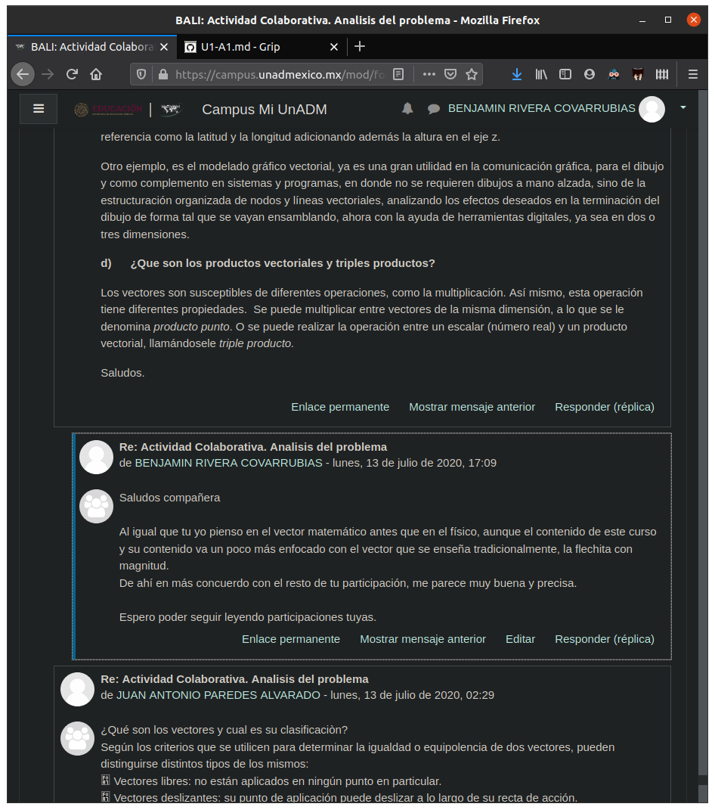

# Actividad 1. Unidad 1. Algebra Lineal
Actividad colaborativa. Análisis del problema.

## Instrucciones
1. Consultar la _planeación docente_.
2. Leer el contenido de la _Unidad 1_.
3. Responder 
	1. Qué son los vectores y cual es su clasificación?
	2. Cuál es la información que proporcionan los vectores?
	3. Menciona dos ejemplos en la vida cotidiana donde utilices los vecotes
	4. Qué son lso productos vectoriales y triples productos?
4. Retroalimenta a __dos compañeros__
5. Elaborar documento con
	1. Portada
	2. Solución a preguntas anteriores
	3. Con la nomenclatura BALI_U1_A1_XXYZ.  (Sustituir las “XX” por las dos primeras letras de tu primer nombre, la “Y” por la inicial de tu primer apellido y la “Z” por la inicial de tu segundo apellido)
6. Subir actividad

## Actividad
1. __Qué son los vectores y cual es su clasificación?__
Los vectores tienen muchos usos y definiciones que varian poco a poco entre las distintas disciplinas que los utilizan, las que es más común que los utilicen son la física y las matemáticas. Para las matemáticas, un vector es un arreglo, o conjunto, de datos que representan información variada, que puede ir desde un punto en une espacio de dimensión n, hasta un conjunto de entradas para una función. En la física, los vectores son _flechitas_ que indican la magnitud y dirección de algo. Los que se  utilizan en física son los más comunes, y entre ellos destacan los que son fijos, ligados y opuestos.

2. __Cuál es la información que proporcionan los vectores?__
Depende de la interpretación que se les este aplicando a ellos, pero siguiendo el contenido de la unidad, los vectores proporcionan
	1. Punto de inicio,
	2. Punto final,
	3. Dirección y
	4. Magnitud

3. __Menciona dos ejemplos en la vida cotidiana donde utilices los vectores__
En mi vida cotidiana suelo programar, en estos periodos utilizo los vectores matemáticos constantemente, ya que lo arreglos son una estructura bastante útil y común en la programación, y también utilizo los vectores fisicos cuando estoy trabajando con movimiento de automatas y planeación de trayectorias. Fuera de lo anterior, no hay lugares donde utilice los vectores directamente, sin embargo fenomenos en la vida diaria pueden ser representados con ellos como las fuerzas para equilibrar un columpio, las direcciones de los vehiculos en una calle o el movimiento del sol en la boveda celeste

4. __Qué son los productos vectoriales y triples productos?__
El __producto vectorial__ es una operación binaria que definimos entre vectores para poder hacer manipulaciones más intuitivas, geometricamente el resultado es un vector perpendicular al plano que contiene a los dos vectores. Y los __triples productos__ son las formas en que podemos relacionar las operaciones de _producto vectorial_ y de _vector por escalar_

### Fuentes de información

UnADM. (S/D). _Primer semestre Algebra Lineal_. 13 de Julio de 2020, de Universidad Abierta y a Distancia de México | DCSBA Sitio web: https://dmd.unadmexico.mx/contenidos/DCSBA/BLOQUE1/BI/01/BALI/unidad_01/descargables/BALI_U1_Contenido.pdf
	
## Retroalimentación

