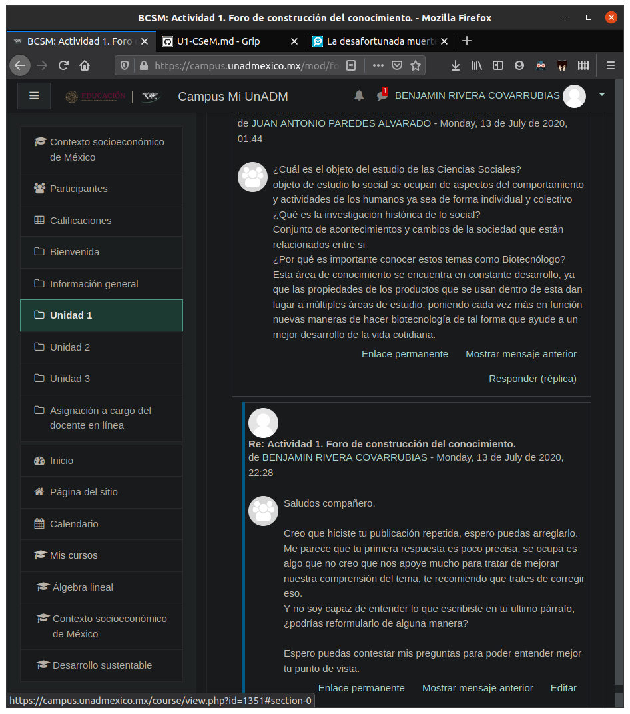
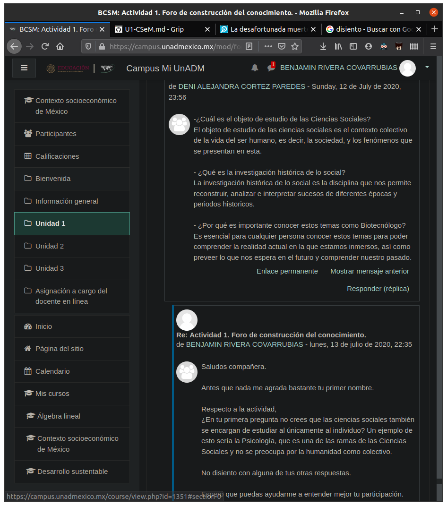

# Actividad 1. Unidad 1. Contexto socioeconómico de México

_Actividad 1_. Foro de construcción del conocimiento.

## Instrucciones
1. Revisar el contenido de la _Unidad 1_
2. Ingresar al _foro de discusión_ y responder
	1. Cuál es el objetivo de estudio de las ciencias sociales?
	2. Qué es la investigación histórica de lo social?
	3. Por qué es importante conocer estos temas como biotecnólogo?
	
3. Revisar y retroalimentar las aportaciones de mis compañeros (al menos una)

## Actividad
1. __Cuál es el objetivo de estudio de las ciencias sociales?__ 
Las ciencias sociales son todas aquellas que tratan de estudiar, comprender y moderar el comportamiento de los individuos y la sociedad, algunas de sus principales ramas son: Sociología, Pedagogía, Economía, Psicología. 

2. __Qué es la investigación histórica de lo social?__ 
Es la herramienta que ayuda a la reconstrucción social y cultural de un individuo, grupo o sociedad. Dicho de otra manera, es aquella que nos permite comprender el presente de algo, y sus porqués, a partir de su contexto histórico y social.

3. __Por qué es importante conocer estos temas como biotecnólogo?__ 
Estrictamente hablando, el conocer la historia y registro de movimientos geográficos de la sociedad le permite a los biotecnólogos, y profesionales de ramas similares, tener un mejor punto de partida a la hora de estudiar las interacciones entre organismos y especies, con todo lo que eso conlleva. Desde el punto no académico, por poco agradable que sea, existen ambientes completamente académicos y siempre estarán involucrados intereses sociales y políticos, el que los biotecnólogos conozcamos de ciencias sociales nos permite comprender mejor esta clase de situaciones y poder desenvolvernos mejor en cualquier ambiente de trabajo.
	
## Retroalimentación

## Fuentes de información

 - UnADM. (S/D). _Introducción al estudio histórico de México_. 13 de Julio de 2020, de Universidad Abierta y a Distancia de México |DCSBA Sitio web: https://campus.unadmexico.mx/contenidos/DCSBA/TC/CSM/unidad_01/descargables/CSM_U1_Contenido.pdf
 - Barell, John. (1999). _El aprendizaje basado en problemas. Un enfoque investigativo._ Buenos Aires: Manantial.
