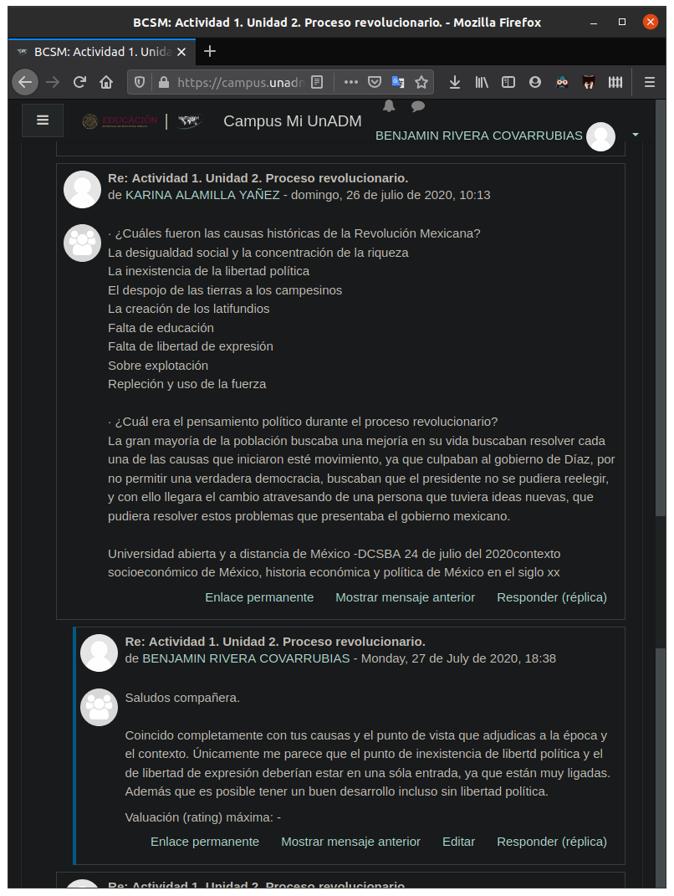
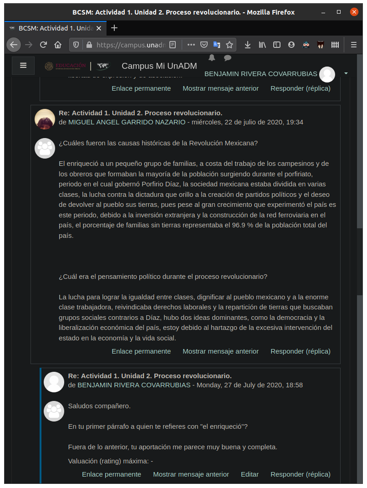

# Actividad 1. Foro de construcción del conocimiento.

Actividad 1. Foro de construcción del conocimiento. Proceso revolucionario.

Fecha de entrega: 27 de julio al 02 de agosto

## Instrucciones

1. Revisa los temas y subtemas de la Unidad 2.

2. Ingresa al Foro de discusión. Comenta sobre el análisis de los temas de la unidad. Para lo cual
realiza una primera aportación contestando lo siguiente:

	- ¿Cuáles fueron las causas históricas de la Revolución Mexicana?
	- ¿Cuál era el pensamiento político durante el proceso revolucionario?

3. Revisa las aportaciones de tus compañeros (as) y realiza tu segunda aportación comentando de
manera respetuosa y clara al menos a dos de tus compañeros(as), para enriquecer el tema.

## Actividad
1. __¿Cuáles fueron las causas históricas de la Revolución Mexicana?__ 
La _revolución de mexicana_, como el evento tan importante y complejo que es, tuvo una gran cantidad de causas y consecuencias, además de que la premura y naturaleza del evento no permitió que hubiera tanta documentación como se podría desear. Sin embargo, es posible identificar algunas de las causas más importantes, entre las cuales podemos mencionar
	- la desigualdad social y la concentración de la riqueza,
	- la represión del pueblo mexicano,
	- la represión y despojo de tierras a campesinos,
	- la concentración de poder y
	- la masiva acumulación de tierras por un pequeño grupo de personas, en su mayoría extranjeros.
	
2. __¿Cuál era el pensamiento político durante el proceso revolucionario?__

Por parte del grupo de poder contemporáneo, posiblemente estaban cegados por su poder político y económico o tenían objetivos en donde olvidaron considerar el aspecto social durante sus planes, lo que no les permitía pensar con claridad en todo lo que estaban causando al resto de las personas con las que coexistían. Y, durante la revolución, definitivamente no querían perder su poder.

Por parte del pueblo mexicano, puede ser que se haya permitido llegar a las condiciones que denotaron la revolución por un recuerdo demasiado fresco de la __guerra de independencia__, por la falta de educación del pueblo y la velocidad en que las noticias se comunicaban. Durante la _revolución mexicana_, el pueblo mexicano ya estaba cansado de las injusticias causadas por aquellos en los grupos de poder, y el _empujoncito_ que dieron aquellos que llamamos héroes de la revolución, fue lo que termino por impulsarlos para que se llevara acabo la revolución. Mientras que por su parte, los héroes revolucionarios, fueron personas cercanas o parte de los grupos de poder, que fueron capaces de darse cuenta que todos somos iguales y merecemos las mismas oportunidades. 
	
## Retroalimentación

## Fuentes de información

 - UnADM. (S/D). _U2 | Historia económica y política de México en el siglo XX_. 27 de Julio de 2020, de Universidad Abierta y a Distancia de México | DCSBA. Sitio web: <https://campus.unadmexico.mx/contenidos/DCSBA/TC/CSM/unidad_02/descargables/CSM_U2_Contenido.pdf>

