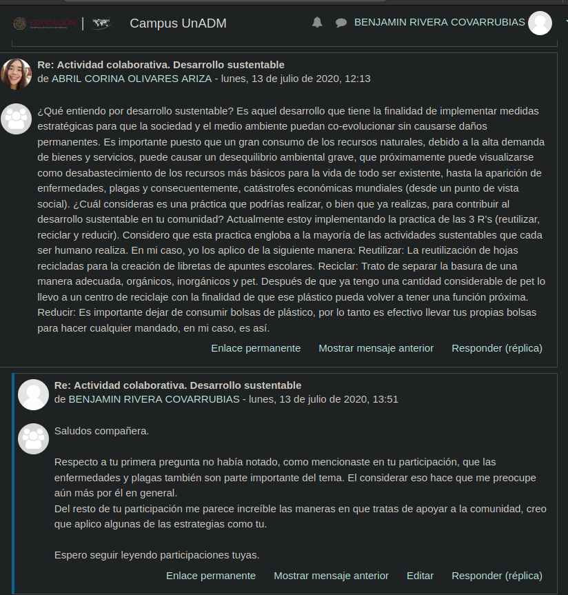

# Actividad 1. Unidad 1. Desarrollo Sustentable

## Instrucciones
1. Revisar contenido de _Unidad 1_.
2. Observar el [video](https://youtu.be/Oy6vHI_jv30) de la actividad.
3. Responder
	1. ¿Qué entiendo por desarrollo sustentable? 
	2. ¿Cuál consideras es una práctica que podrías realizar, o bien que ya realizas, para contribuir al desarrollo sustentable en tu comunidad?
4. Restroalimentar a un compañero.
5. Cuidar ortografía y redacción.
6. Antes del __14 de Julio__

## Actividad
1. _¿Qué entiendo por desarrollo sustentable?_	
Es el concepto en el que catalogamos a las ideas capaces de promover un avance como sociedad que permita que ls futuras generaciones no sufran de escaces de recursos por nuestro consumo. También es el plan de acción que mantiene respeto por igual para con la naturaleza, los individuos y la sociedad.
	
2. _¿Cuál consideras es una práctica que podrías realizar, o bien que ya realizas, para contribuir al desarrollo sustentable en tu comunidad?_
Personalmente yo me siento bastante comprometido con el medio ambiente, aunque no siempre lo he reconocido como desarrollo sustentable. Algunas de las acciones que realizo en mi vida diaria para contribuir con el desarrollo sustentable son
	1. Limitar mi uso de productos desechables
	2. Cargar con cubiertos reutilizables
	3. Separar la basura
	4. Utilizar energías renovables en actividades en mi casa
	
## Retroalimentación

