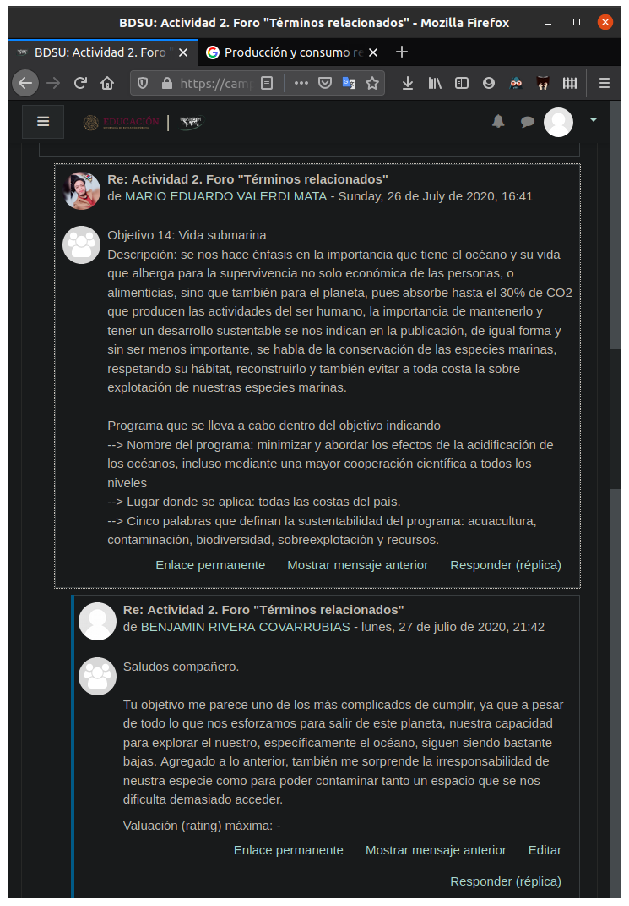
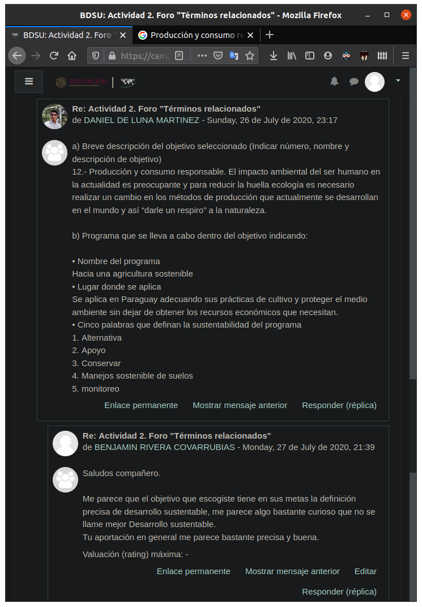

# Actividad 2. Foro Términos relacionados al desarrollo sustentable

Actividad 2. Foro Términos relacionados al desarrollo sustentable \
Unidad 2 \
_Fecha de entrega:_ 29 de julio de 2020

## Instrucciones

1. Revisar el contenido de la unidad 2.

2. Seleccionar en el sitio web del Programa de las Naciones Unidas para el Desarrollo (PNUD) en México uno de los 17 objetivos del programa. Liga de acceso: <https://www.mx.undp.org/content/mexico/es/home/sustainable-development-goals.html>

3. Publicar una participación en el foro, utilizando palabras propias, que incluya:
	1. Breve descripción del objetivo seleccionado (Indicar número, nombre y descripción de objetivo)
	2. Programa que se lleva a cabo dentro del objetivo indicando:
		- Nombre del programa
		- Lugar donde se aplica
		- Cinco palabras que definan la sustentabilidad del programa
4. Retroalimentar enriquecedoramente a un compañero enfatizando en el contenido de su
participación.
5. Cuidar la ortografía y redacción.

## Actividad

Saludos compañeros, les comparto mi participación de este foro.

Antes de comenzar me parece pertinente establecer un contexto. La _agenda 2030_ fue adoptada por la ONU, y es un plan para lograr el desarrollo sostenible a nivel global. Dentro de esta agenda se establecieron _17 objetivos_ a los que los países que firmaron se comprometieron a cumplir en el año 2030.

### Breve descripción del objetivo seleccionado (Indicar número, nombre y descripción de objetivo)
	
Dentro de los objetivos establecidos en este programa, el que más me llamo la atención, y que considero que es en el que más podría apoyar yo, es el _objetivo 4_.

El _objetivo 4_ habla de la educación de calidad, y busca ofrecer opciones de educación inclusiva y de calidad para todas las personas, tanto de nivel universitario como técnico. Con este fin, el objetivo busca asegurar que todas las niñas y niños completen su educación primaria y secundaria gratuita para 2030. 
	
### Programa que se lleva a cabo dentro del objetivo indicando:

Uno de los proyectos que trata apoyar el desarrollo de este objetivo se llama __Todo ha cambiado para siempre__, Es un proyecto que busca que los profesores utilicen musica para comunicarse con sus alumnos, ya que no todas las cosas pueden comunicarse con palabras. Este programa es desarrollado en la escuela primaria Al Ribat en Trípoli, que es la capital de Libia. Este proyecto creo que podría describirse con las palabras
 - música,
 - educación,
 - inclusión,
 - comunitario y
 - reducción de las desigualdades.

## Retroalimentación

## Referencias

- S/D. (2020). _U2 | Dimensiones y retos de la sustentabilidad_. 27 de julio de 2020, de UnADM Sitio web: <https://dmd.unadmexico.mx/contenidos/DCSBA/BLOQUE1/BI/01/BDSU/unidad_02/descargables/BDSU_U2_Contenido.pdf>
- S/D. (S/D). _Objetivo 4: Educación de calidad_. 27 de julio de 2020, de PNUD Sitio web: <https://www.mx.undp.org/content/mexico/es/home/sustainable-development-goals/goal-4-quality-education.html>
- ONU Desarrollo. (2019). _Todo ha cambiado para siempre_. 27 de julio de 2020, de Medium Sitio web: <https://medium.com/@pnud/todo-ha-cambiado-para-siempre-fa98dfdf4bce>

