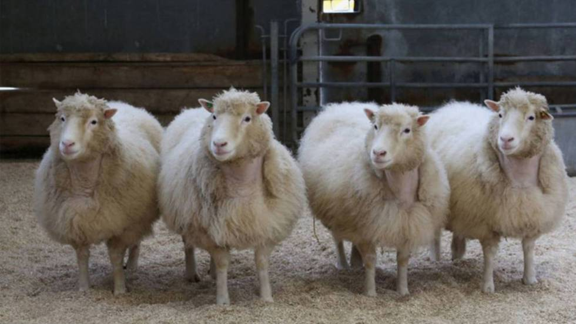

# Actividad. Foro de construccion del conocimieto

Actividad. Foro de construcción del conocimiento.

Fecha de entrega: 1 de noviembre

¡Haremos una pizza de valores!

## Actividad

__Instrucciones__

1. Mira el siguiente video [https://bit.ly/3jdv1hq]
2. Identifica los valores más sobresalientes en el video según tu criterio.
3. Diseña una pizza en “Sumo Paint” donde coloques en cada rebanada el nombre de uno de esos valores.
4. Haz una captura de pantalla de la pizza terminada donde se aprecie el uso de la aplicación.
5. Reflexiona y contesta cómo sería nuestra sociedad si todas las personas actuaran y aplicaran los valores que colocaste en tu pizza.
6. Publica la imagen de la pizza con los valores que identificaste y la reflexión en una participación en el foro. No es válido subir archivos, sino más bien utiliza el editor del texto para colocar tu participación, junto con la imagen.
7. Coloca tu opinión en al menos otras dos pizzas y sus valores para enriquecer el intercambio de ideas.

### Resp

#### 1

Gemelas chinas editadas genéticamente

#### 3

Un investigador, originario de China, llevó a cabo un experimento en el cual alteró genéticamente a dos gemelas que fueron fecundadas in vitro. Este experimento está inmiscuido en varias irregularidades; entre ellas se encuentra la falta de registro en la base de datos de experimentos en china, la falta de participación de un ginecólogo en el experimento, una cadena de custodia inconsistente con los resultados del experimento, entre otras. Además de lo anterior, recientemente se ha encontrado evidencia de que los padres de las dos gemelas identificadas no fueron informados de la totalidad de las posibles complicaciones con las que se podrían enfrentar sus hijas (las gemelas) al nacer.
Por todas estas irregularidades, y el deseo del gobierno de china porque este experimento no sea tan publicó; el artículo original, que escribió el investigador _He Jiankui_ (supuesto jefe de investigación del proyecto), es muy difícil de conseguir y está censurado en muchos sitios públicos.

#### 4

En este caso, la única norma general de ética profesional que identificó que se incumple en esta situación, es la número 1 _actuar de manera honesta y responsable_. Aunque me parece que es de las más graves de todas.

En esta situación el grupo de investigación no fueron del todo honestos ni con aquellos a quienes convencieron para participar en el experimento, ni con su gobierno, ni con la comunidad mundial de investigadores. Esto causó varias cosas; por un lado, ahora esta rama de la investigación está públicamente manchada, lo que dificultará que reciba fondos tanto del sector público como privado; por otro lado, al apresurarse y no ser del todo honestos con aquellos que participaron en el proyecto, aquellos individuos genéticamente modificados pueden tener una salud no del todo sana durante el resto de sus vidas.

#### 5

## Referencias

- Montoliu, L. (2019, 7 diciembre). _Nuevos datos sobre las gemelas chinas editadas genéticamente confirman que el experimento fue tan irresponsable como parecía desde el primer día_. Gen-Ética. <https://montoliu.naukas.com/2019/12/08/nuevos-datos-sobre-las-gemelas-chinas-editadas-geneticamente-confirman-que-el-experimento-fue-tan-irresponsable-como-parecia-desde-el-primer-dia/>

- (s. a). (2018, 26 noviembre). _Un científico chino afirma ser el primero en modificar bebés genéticamente_. La Vanguardia. <https://www.lavanguardia.com/vida/20181126/453164870255/he-jiankui-cientifico-chino-modificar-bebes-geneticamente.html>

- Santirso, J. (2019, 30 diciembre). _Condenado a tres años de cárcel el científico chino que creó los primeros bebés modificados genéticamente_. EL PAÍS. <https://elpais.com/elpais/2019/12/30/ciencia/1577710962_002091.html>
